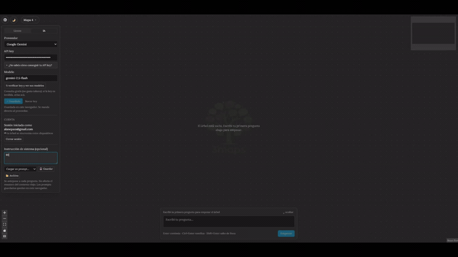

# 3maps

## ¿Qué es 3maps?

3maps es una aplicación web pensada para resolver un problema común en los
chats con IA: son lineales. Si en medio de una respuesta querés repreguntar
sobre un punto puntual, no hay otra que seguir abajo — y el hilo original
queda enterrado.


3maps te deja repreguntar hacia el costado: cada repregunta abre una rama
nueva sin tocar la conversación principal, y esas ramas van formando un mapa
de nodos navegable.

**Probala:** https://alanepazs.github.io/3maps/ — sin instalar nada, sin cuenta.

 




---

## Cómo funciona (para dummies)

**Es local-first: sin cuenta ni servidor propio, todo pasa en tu navegador.** Abrís
la web y ya estás listo — no hay nada que activar.

- **Tus conversaciones** viven en el `localStorage` del navegador. Cada pregunta +
  respuesta es un archivito Markdown; un conjunto = un mapa. Cerrás la pestaña,
  volvés en la misma compu y el mismo navegador, y sigue todo ahí. (Otra compu u
  otro navegador → no lo ve; en modo local no hay backup en la nube.)
- **La IA responde con tu propia API key** (Google Gemini es gratis y es el
  default). Tu key se guarda solo en tu navegador y viaja **directo al proveedor** —
  la infraestructura de 3maps nunca la ve. Algunos proveedores no habilitan CORS y
  pasan por un proxy *stateless* que solo reenvía (opt-in, no loguea nada).
- **También podés correr el modelo en tu propia máquina** con
  [Ollama](https://ollama.com) (proveedor "Ollama (local)"): cero tokens, cero
  costo, nada sale de tu red. Chrome/Edge de escritorio.
- **No manda todo el árbol a la IA.** Solo el camino raíz → globo actual; lo más
  viejo de esa rama se resume en unas frases. Así una charla larga no cuesta como
  reenviar todo cada vez.
- **Exportás** un mapa como `.zip` de los `.md` (y lo volvés a importar).

## Modo local vs. con cuenta

El backend (Supabase) es **opcional**. Sin las env `NEXT_PUBLIC_SUPABASE_*` la app
es 100% local.

| | Local (default) | Con cuenta |
|---|:---:|:---:|
| IA, ramificar, el lienzo entero | ✅ | ✅ |
| Guardado en el navegador | ✅ | ✅ |
| Login (Google / magic-link) | — | ✅ |
| Compartir un mapa por link | — | ✅ |
| Sincronizar entre dispositivos | — | ✅ |
| Keys en todos tus dispositivos | — | ✅ |

## Proveedores de IA

- **Gratis, sin tarjeta:** Google Gemini, Groq, OpenRouter, Hugging Face.
- **Pagos (traés saldo):** Claude (Anthropic), OpenAI, DeepSeek.
- **Local:** Ollama, corriendo en tu máquina.

Adjuntás texto, imágenes y PDF (según lo que soporte el modelo elegido).

## Stack

- Next.js 16 (App Router, Turbopack) + React 19 + TypeScript + Tailwind CSS 4
- Canvas de nodos: [React Flow](https://reactflow.dev/) (`@xyflow/react` v12)
- Backend opcional: Supabase (login, compartir, sync, proxy de IA)
- Deploy: GitHub Pages (`output: "export"`, estático — todo corre client-side)

## Correr en local

```bash
npm install
npm run dev          # http://localhost:3000
```

Sin `.env.local` corre igual, sin la parte de Supabase.

## Privacidad

La API key del usuario vive solo en su navegador y va directo al proveedor — nunca
se almacena en infraestructura de terceros. Los proveedores vía proxy solo
*transitan* un edge function *stateless* que no loguea ni guarda. Nunca se
commitean claves ni archivos `.env` (el repo es público).

## Documentación

- [`CLAUDE.md`](CLAUDE.md) — invariantes y convenciones del proyecto
- [`docs/spec-proyecto.md`](docs/spec-proyecto.md) — diseño: modelo de datos
  (`.md` por intercambio), algoritmo de contexto, costos de tokens, roadmap
- [`docs/arquitectura.md`](docs/arquitectura.md) — qué hace cada archivo de `src/`
- [`docs/decisiones.md`](docs/decisiones.md) — por qué el código es como es
